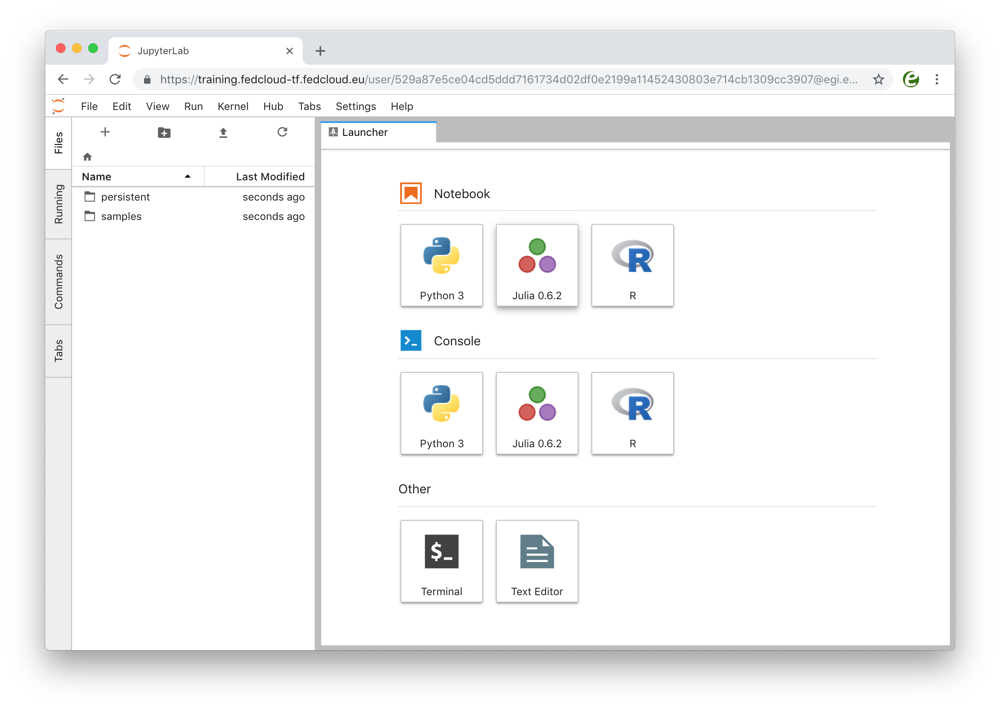

# EGI Notebooks training @ DI4R

This repository is used as material for the following training session:

https://indico.egi.eu/indico/event/3973/session/47/?slotId=0#20181010

## Accessing the service

The training environment for the Notebooks is available at
 https://training.fedcloud-tf.fedcloud.eu
To log in just:
1. Go to https://training.fedcloud-tf.fedcloud.eu
2. Start the authentication process by clicking on **Sign in with EGI Check-in**
   button
   

   
3. Select the Identity Provider you belong to from the discovery page (as this
   is using EGI Check-in development, some of the Identity Providers may not be
   completely supported, so it's recommended to use _social identities_ (e.g.
   Google, Facebook, ORCID)
   

4. You will see the [JupyterLab](https://github.com/jupyterlab/jupyterlab)
   interface once your personal notebook is started

## Launching a notebook

Click on the Notebook > Python 3 icon to launch your notebook with Python 3
kernel. When you create this notebook, a new tab will be presented with a
notebook named `Untitled.ipynb`. You can easily rename it by right-clicking on
the current name.

### Structure of a notebook

