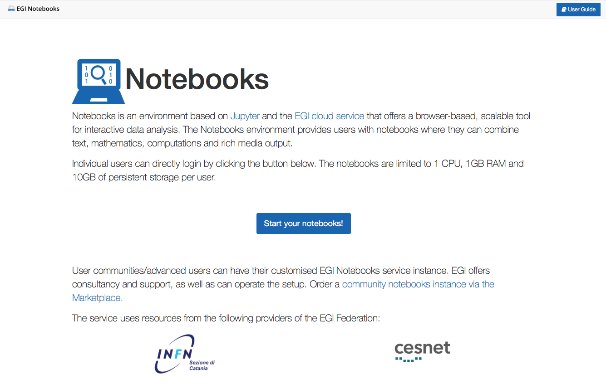
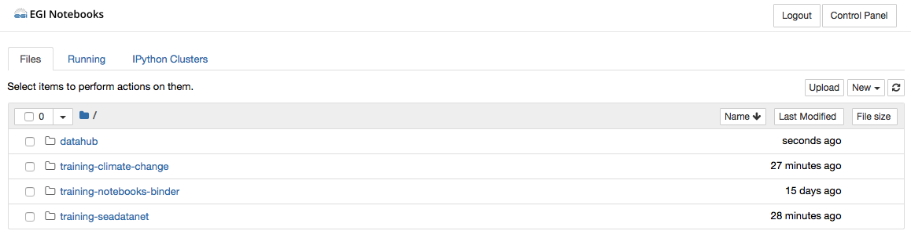

# EGI Notebooks training @ EaPEC 2019

This repository is used as material for the following training session:

https://events.geant.org/event/2/

## Accessing the service

The training environment for the Notebooks is available at:
 https://training.notebooks.egi.eu
 
To log in just:
1. Go to https://training.notebooks.egi.eu
2. Start the authentication process by clicking on **Start your notebooks!** button

3. Select the Identity Provider you belong to from the discovery page (as this
   is using EGI Check-in development, some of the Identity Providers may not be
   completely supported, so it's recommended to use _social identities_ (e.g.
   Google, Facebook, ORCID)

4. You will see the basic interface once your personal notebook is started

## Launching a notebook

Click on the "New" drop-down list, select Python 3 icon to launch your notebook with Python 3
kernel from the Notebook menu. When you create this notebook, a new tab will be presented with a
notebook named `Untitled.ipynb`. You can easily rename it by right-clicking on the current name.

### Structure of a notebook

The notebook consists of a sequence of cells. A cell is a multiline text input
field, and its contents can be executed by using `Shift-Enter`, or by clicking
either the _“Play”_ button in the toolbar, or Cell -> Run in the menu bar.

The execution behaviour of a cell is determined by the cell’s type.

There are three types of cells: cells, markdown, and raw cells.
Every cell starts off being a code cell, but its type can be changed by using
a drop-down on the toolbar (which will be “Code”, initially).

#### Code cells

A code cell allows you to edit and write new code, with full syntax
highlighting and tab completion. The programming language you use depends on
the kernel.

When a code cell is executed, its content is sent to the kernel associated
with the notebook. The results that are returned from this computation are
then displayed in the notebook as the cell’s output. The output is not
limited to text, with many other possible forms of output are also possible,
including figures and HTML tables.

#### Markdown cells

You can document the computational process in a literate way, alternating
descriptive text with code, using rich text. This is accomplished by
marking up text with the Markdown language. The corresponding cells are
called Markdown cells. The Markdown language provides a simple way to
perform this text markup, that is, to specify which parts of the text should
be emphasized (italics), bold, form lists, etc.

If you want to provide structure for your document, you can also use markdown
headings. Markdown headings consist of 1 to 6 hash `#` signs followed by a
space and the title of your section. The markdown heading will be converted
to a clickable link for a section of the notebook. It is also used as a hint
when exporting to other document formats, like PDF.

When a Markdown cell is executed, the Markdown code is converted into the
corresponding formatted rich text. Markdown allows arbitrary HTML code for
formatting.

#### Raw cells

Raw cells provide a place in which you can write output directly. Raw cells
are not evaluated by the notebook.

### Keyboard shortcuts

All actions in the notebook can be performed with the mouse, but keyboard
shortcuts are also available for the most common ones. These are some of the
most common:
- `Shift-Enter`: run cell. Execute the current cell, show any output,
  and jump to the next cell below. If `Shift-Enter` is invoked on the last
  cell, it creates a new cell below. This is equivalent to clicking the
  Cell -> Run menu item, or the Play button in the toolbar.
- `Esc`: Command mode. In command mode, you can navigate around the notebook
  using keyboard shortcuts.
- `Enter` : Edit mode. In edit mode, you can edit text in cells.

## Hands-on

1. [00-first-notebook.ipynb](./00-first-notebook.ipynb) 

A very basic notebook to get started

2. [cckp_historical_temperature.ipynb](./training-climate-change/cckp_historical_temperature.ipynb) 

Calculate the historical precipitation data derived from the Climate Research Unit (Mitchell et at, 2003) aggregated to country and basin levels.
